# Stellar Luminosity: Linear and Polynomial Regression

## Descripción del Proyecto

Este proyecto implementa regresión lineal y polinomial desde primeros principios para modelar la luminosidad estelar como función de la masa y temperatura estelar.

## Estructura del Repositorio

```
/
├── img/
├── README.md
├── 01_part1_linreg_1feature.ipynb
└── 02_part2_polyreg.ipynb
```

## Requisitos

- Python 3.x
- NumPy
- Matplotlib

### Parte 1: Regresión Lineal con Una Característica

**Objetivo:** Modelar la relación entre masa estelar (M) y luminosidad (L) usando un modelo lineal simple.

**Desarrollo:**

1. **Análisis Exploratorio**: Se visualizó el dataset para identificar la relación entre M y L. Se observó que la relación es claramente no lineal, lo cual es consistente con la física estelar (L ∝ M^α, donde α ≈ 3-4).

2. **Implementación del Modelo**: 
   - Función de hipótesis: `L_hat = w * M + b`
   - Función de pérdida: Mean Squared Error (MSE)
   - Implementación manual sin usar scikit-learn

3. **Visualización de la Superficie de Costo**: Se evaluó J(w,b) en una grilla de valores para visualizar el espacio de optimización. La superficie mostró forma de "bowl" característica de problemas convexos.

4. **Gradientes Analíticos**: Se derivaron matemáticamente los gradientes:
   - ∂J/∂w = -2/n * Σ(L_i - L_hat_i) * M_i
   - ∂J/∂b = -2/n * Σ(L_i - L_hat_i)

5. **Descenso de Gradiente**: Se implementaron dos versiones:
   - **No vectorizada**: Loop explícito sobre muestras (para comprensión)
   - **Vectorizada**: Operaciones NumPy optimizadas (para eficiencia)

6. **Análisis de Convergencia**: Se experimentó con diferentes learning rates (0.001, 0.01, 0.1) para analizar velocidad y estabilidad de convergencia.

7. **Evaluación**: Se identificaron errores sistemáticos que confirman las limitaciones del modelo lineal para capturar relaciones no lineales.

### Parte 2: Regresión Polinomial con Múltiples Características

**Objetivo:** Capturar relaciones no lineales e interacciones usando ingeniería de características polinomiales.

**Desarrollo:**

1. **Ingeniería de Características**: Se construyó la matriz de diseño X con características:
   - Lineales: M, T
   - Cuadráticas: M²
   - Interacciones: M*T

2. **Normalización**: Se implementó normalización estándar (z-score) para evitar problemas de overflow debido a las diferentes escalas entre características (M ~ 0.6-2.4 vs T ~ 3800-9200).

3. **Regresión Múltiple**: Se extendió el modelo a múltiples características:
   - Predicción: `L_hat = X @ w + b`
   - Gradientes vectorizados usando operaciones matriciales

4. **Experimentos de Selección de Características**: Se compararon tres modelos:
   - **M1**: [M, T] - Modelo lineal básico
   - **M2**: [M, T, M²] - Incluye término cuadrático
   - **M3**: [M, T, M², M*T] - Modelo completo con interacción

5. **Análisis de Importancia**: Se varió el coeficiente de interacción w_MT para analizar su impacto en el costo, demostrando la importancia del término de interacción.

6. **Inferencia**: Se realizó una predicción para una nueva estrella (M=1.3, T=6600) para demostrar el uso del modelo entrenado.

### Resultados Clave

- **Parte 1**: El modelo lineal mostró limitaciones claras para capturar la relación no lineal masa-luminosidad, con errores sistemáticos crecientes.
- **Parte 2**: El modelo polinomial completo (M3) mostró mejor ajuste, confirmando la importancia de términos cuadráticos e interacciones.
- **Normalización**: Fue crítica para la estabilidad numérica del descenso de gradiente con características de diferentes escalas.

## Contenido de los Notebooks

### Notebook 1: Regresión Lineal (Una Característica)
- Modela la luminosidad estelar (L) como función de la masa estelar (M)
- Implementación desde cero de:
  - Función de hipótesis: L_hat = w * M + b
  - Función de pérdida (MSE)
  - Gradientes analíticos
  - Descenso de gradiente (versión no vectorizada y vectorizada)
  - Visualización de superficie de costo
  - Análisis de convergencia

### Notebook 2: Regresión Polinomial (Dos Características)
- Modela la luminosidad estelar usando masa (M) y temperatura (T)
- Implementación de:
  - Ingeniería de características polinomiales: [M, T, M², M*T]
  - Normalización de características
  - Regresión con múltiples características
  - Experimentos de selección de características
  - Análisis de importancia de interacciones

## AWS SageMaker Execution Evidence

### Descripción del Proceso de Despliegue

Los notebooks fueron desplegados en AWS SageMaker siguiendo los siguientes pasos:

1. **Acceso a AWS Student**: Ingresar a la plataforma AWS Student con las credenciales proporcionadas
2. **Lanzar el laboratorio**: Activar el laboratorio al que se tiene acceso asignado
3. **Navegar a SageMaker**: Dirigirse hacia SageMaker que ha sido previamente creado siguiendo el tutorial proporcionado
4. **Abrir Code Editor**: Una vez en SageMaker, seleccionar la opción "Code Editor"
5. **Encender el entorno**: Activar el Code Editor
6. **Cargar notebooks**: Los archivos `.ipynb` estarán disponibles en el explorador de archivos del Code Editor
7. **Ejecutar notebooks**: Ejecutar secuencialmente todas las celdas de ambos notebooks (`01_part1_linreg_1feature.ipynb` y `02_part2_polyreg.ipynb`)

### Evidencia de Ejecución

#### 1. Dominio de SageMaker

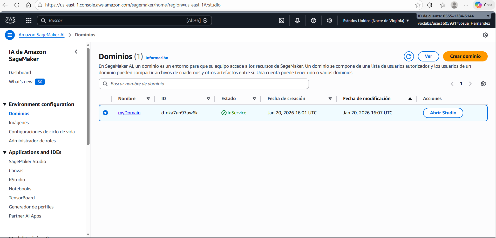

#### 2. Code Editor de SageMaker


#### 3. Visual Cloud con Archivos del Proyecto

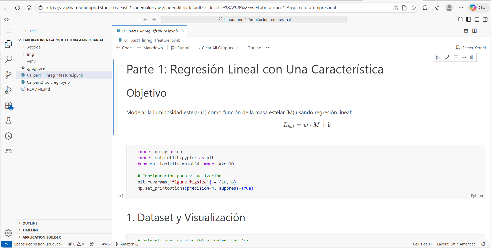

### Evidencia de Ejecución - Notebook 1: Regresión Lineal

#### Dataset y Visualización Inicial

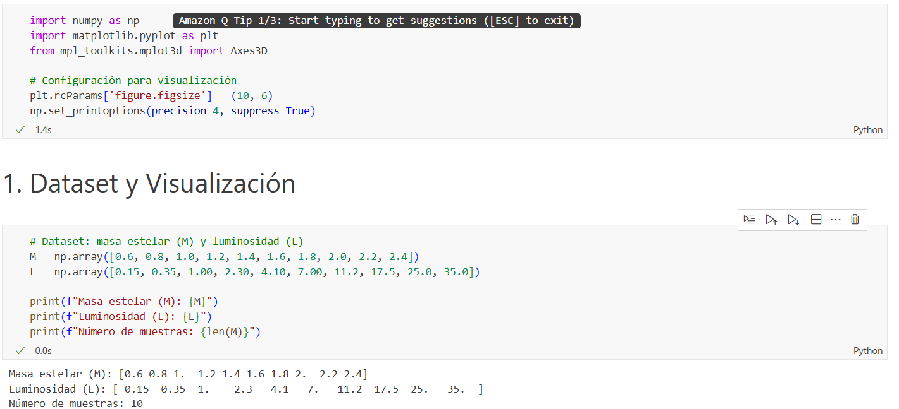

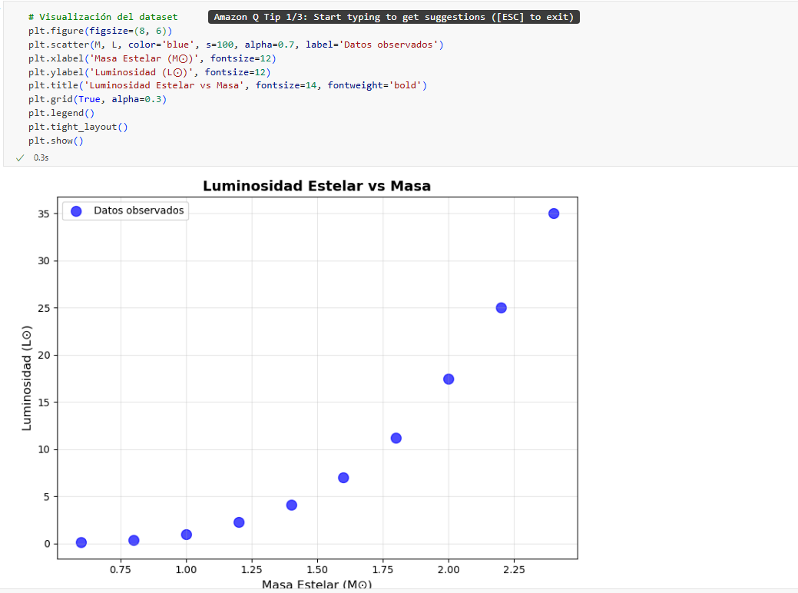

#### Implementación del Modelo

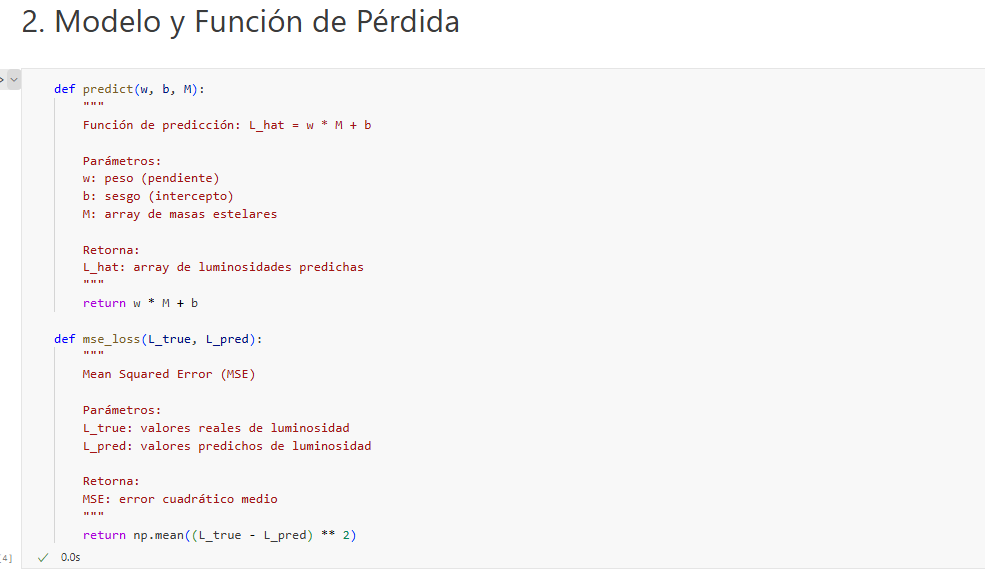

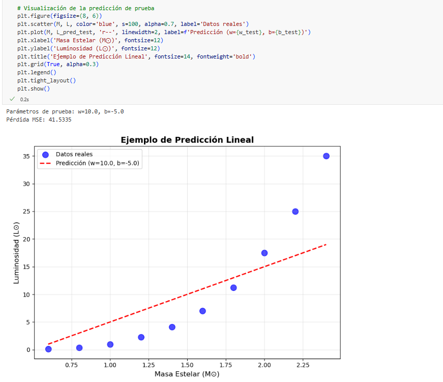

#### Superficie de Costo

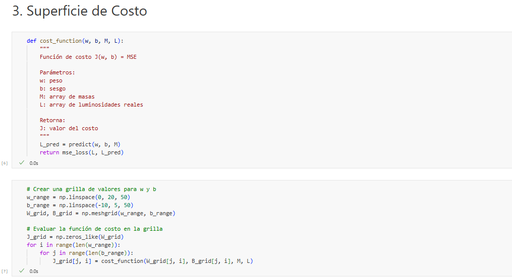

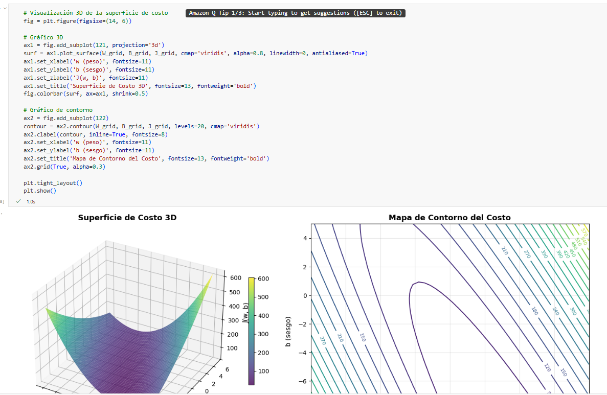

#### Implementación de Gradientes

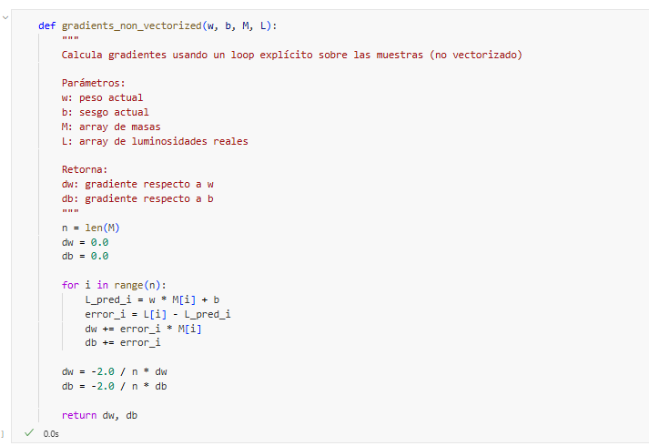

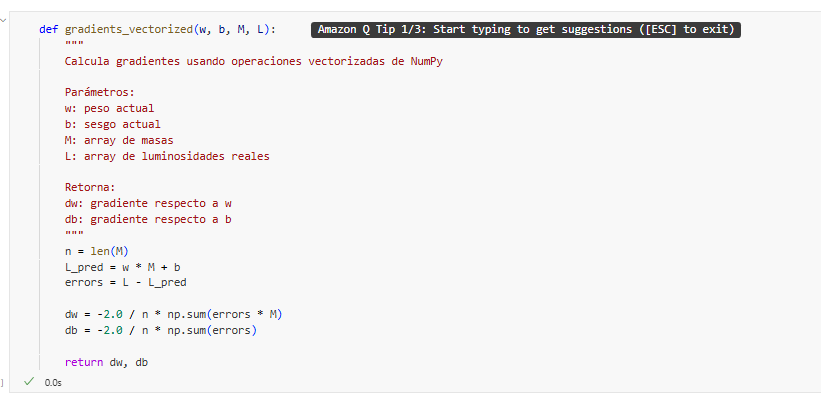

#### Resultado Final

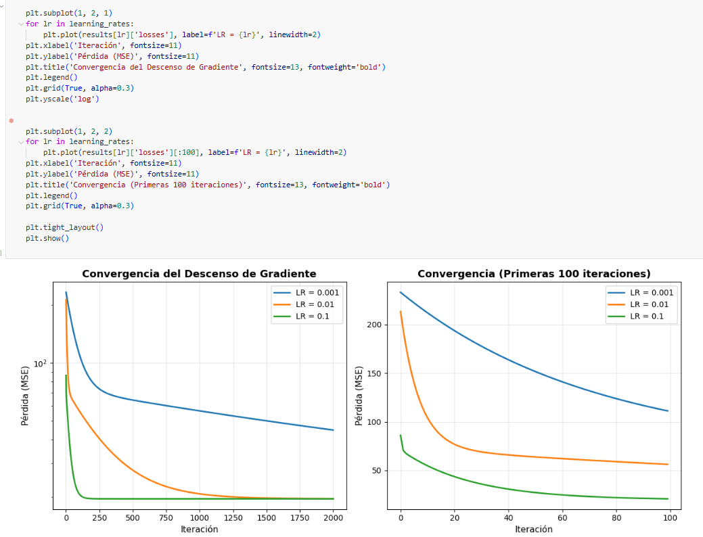

### Evidencia de Ejecución - Notebook 2: Regresión Polinomial

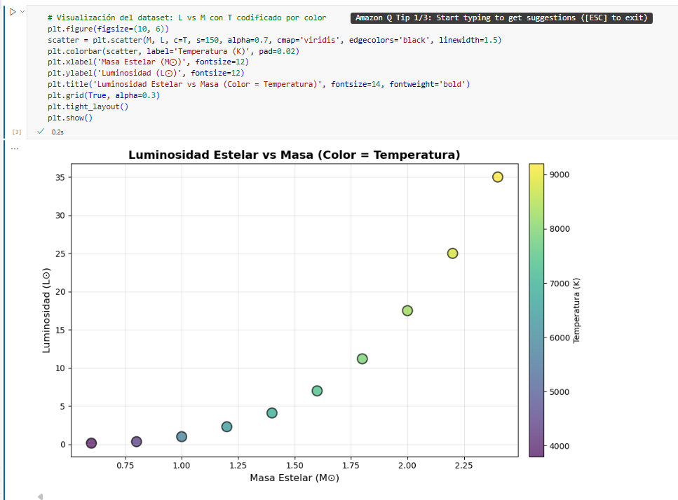

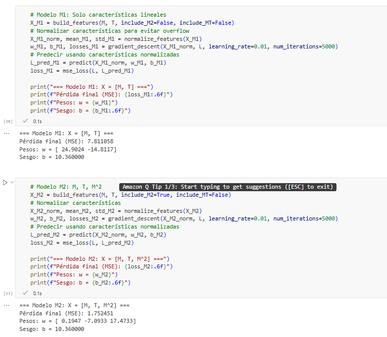

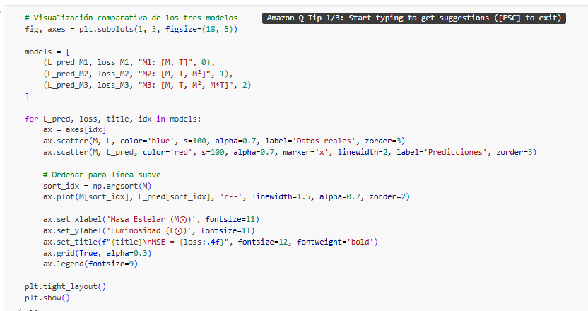


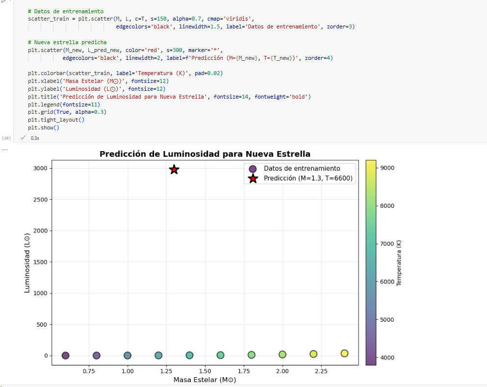

### Comparación: Ejecución Local vs SageMaker

**Ejecución Local:**
- Desarrollo y depuración inicial en entorno local
- Visualizaciones renderizadas en navegador local
- Tiempo de ejecución rápido para datasets pequeños
- Requiere configuración de entorno virtual y dependencias

**Ejecución en SageMaker:**
- Ambiente cloud escalable y reproducible
- Visualizaciones integradas en la interfaz de SageMaker Code Editor
- Capacidad para escalar a datasets más grandes si es necesario
- Facilita colaboración y documentación de experimentos
- No requiere configuración local de dependencias (NumPy y Matplotlib ya están preinstalados)

**Observación:**
- Las visualizaciones de Matplotlib se renderizan correctamente en ambos entornos
- El rendimiento es similar para datasets pequeños como el utilizado
- El Code Editor de SageMaker ofrece una experiencia similar a VS Code local

